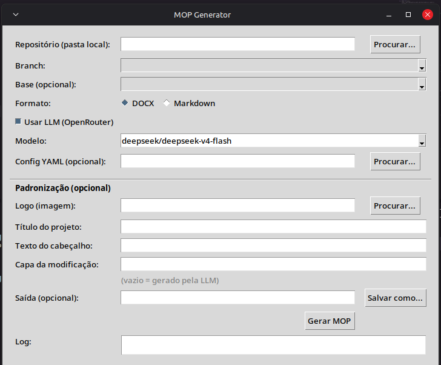

# MOP Generator

Ferramenta de linha de comando (CLI) para gerar documentos **MOP (Method of Procedure)** a partir de um repositório Git.

O MOP é um documento que detalha a implementação, o procedimento e a subida (deploy) de uma mudança. Esta ferramenta é **agnóstica a empresa** e focada 100% na **branch e nas modificações do usuário**: ela entende o contexto do projeto (linguagens, stack, descrição) e as alterações da branch (commits, diff, arquivos) para gerar o documento em `.docx` ou `.md`.

## Como funciona

1. Você informa o repositório (URL SSH ou caminho local) e a branch.
2. A ferramenta clona/atualiza o repositório via SSH e extrai:
   - Nome da branch e do remote (usado na seção "Acesso ao DevOps")
   - Commits da branch em relação a uma branch base (ex.: `main`), ignorando merges
   - Arquivos alterados e o diff
   - **Contexto do projeto**: linguagens, stack/frameworks, nome e descrição
     (inferidos de manifests como `package.json`/`pyproject.toml`, `Dockerfile`,
     pipelines e do `README`)
3. O conteúdo técnico (objetivo, tabela de mudanças, impacto, backup, validação,
   rollback) é gerado automaticamente:
   - via **LLM** (OpenRouter), quando habilitado, usando o contexto do projeto e o diff; ou
   - a partir dos commits, quando o LLM está desligado.
4. O que a ferramenta não tem como saber pelo código (janela de deploy, links de
   PR, responsáveis) vem de um `config.yaml` opcional e/ou de prompts interativos.
   Campos não preenchidos aparecem como "A preencher" no documento.
5. O documento MOP é gerado no formato escolhido (`.docx` com índice, ou `.md`).

## Instalação

```bash
python -m venv .venv
source .venv/bin/activate
pip install -e .
```

Requisitos:
- Python 3.9+
- Git instalado e configurado (com acesso SSH ao repositório)

## Geração com LLM (OpenRouter)

A ferramenta pode usar um LLM via [OpenRouter](https://openrouter.ai) para
redigir automaticamente o conteúdo técnico do MOP (objetivo, tabela de mudanças,
impacto, plano de backup, validação e rollback) a partir dos commits e do diff
da branch.

1. Copie `.env.example` para `.env` e preencha a chave:

   ```bash
   cp .env.example .env
   # edite .env e defina OPENROUTER_API_KEY
   ```

   Variáveis suportadas:
   - `OPENROUTER_API_KEY` (obrigatória para o LLM)
   - `OPENROUTER_MODEL` (opcional, padrão `openai/gpt-4o-mini`)
   - `OPENROUTER_BASE_URL` (opcional)
   - `OPENROUTER_APP_TITLE` / `OPENROUTER_APP_URL` (opcionais)

2. Rode normalmente. Se `OPENROUTER_API_KEY` existir, o LLM é usado por padrão:

   ```bash
   mop generate --repo <ssh-url> --branch feature/x --base main --format docx
   ```

Controle do LLM:
- `--use-llm` / `--no-llm`: força ligar/desligar o uso do LLM.
- `--model <id>`: sobrescreve o modelo do `.env`.
- `--llm-context "texto"`: passa contexto extra (motivação, requisitos) ao modelo.

Precedência: valores definidos no `config.yaml` sempre têm prioridade sobre o que
o LLM gerar; o LLM só preenche campos que ainda estão vazios. O que o LLM não sabe
(data da janela, links de PR, responsáveis) continua vindo do config ou dos prompts.

### Alterações de API (endpoints e payloads)

Quando a branch altera endpoints HTTP (rotas, controllers, views, DTOs, serializers
ou specs OpenAPI), o LLM gera automaticamente uma seção **"2. Alterações de API
(Endpoints e Payloads)"** com, para cada endpoint:

- Método + rota e o tipo de mudança (Novo/Alterado/Removido)
- Headers da requisição
- Exemplo de corpo do request (JSON inferido do código)
- Status e exemplo de corpo do response
- Notas (ex.: casos de erro)

Se a branch não mexe em API, a seção é omitida.

## Uso

Modo interativo (pergunta os campos manuais):

```bash
mop generate --repo git@ssh.dev.azure.com:v3/Org/Projeto/meu-servico \
             --branch feature/nova-pipeline \
             --base main \
             --format docx \
             --output MOP_meu-servico_nova-pipeline.docx
```

Usando um arquivo de configuração com valores padrão:

```bash
mop generate --repo <ssh-url> --branch <branch> --config config.yaml --format md
```

Repositório local (sem clone):

```bash
mop generate --repo /caminho/para/repo --branch feature/x --format md
```

Modo não interativo (campos ausentes ficam como "A preencher"):

```bash
mop generate --repo <ssh-url> --branch <branch> --config config.yaml --non-interactive
```

Veja `config.example.yaml` para o formato do arquivo de configuração.

## Interface gráfica (UI)

Além do CLI, há uma interface gráfica simples. Você escolhe a **pasta local do
repositório**, seleciona a **branch** numa lista, escolhe o formato e gera o MOP.



```bash
python ui.py
# ou, após instalar o pacote:
mop-ui
```

A UI usa `tkinter`, que no Linux é um pacote de sistema separado. Se aparecer um
aviso de que o tkinter não está disponível, instale-o:

```bash
sudo apt install python3-tk    # Debian/Ubuntu
```

Na janela:
- **Procurar...** seleciona a pasta do repositório; as branches são carregadas
  automaticamente na lista.
- **Branch**: branch a analisar. **Base**: branch de comparação (padrão: main/
  master/develop se existir, ou "todos os commits").
- **Formato**: DOCX ou Markdown.
- **Usar LLM**: habilitado automaticamente se houver `OPENROUTER_API_KEY` no `.env`.
- A geração roda em segundo plano e o progresso aparece no log; ao final, um
  aviso mostra o caminho do arquivo e os campos pendentes.

## Testes

A suíte cobre os dois modos de operação, sem depender de rede:

- **Sem LLM** (`tests/test_no_llm.py`): usa um repositório Git real criado em
  diretório temporário; valida extração do Git, contexto do projeto, geração de
  Markdown/DOCX (índice incluso) e o CLI ponta a ponta.
- **Com LLM** (`tests/test_with_llm.py`): mocka a chamada HTTP ao OpenRouter
  (nenhuma requisição real, nenhuma API key necessária); valida o parsing do
  JSON, a precedência do config sobre o LLM e o CLI com `--use-llm`.

```bash
pip install -e ".[dev]"
pytest -q                      # tudo
pytest tests/test_no_llm.py    # só sem LLM
pytest tests/test_with_llm.py  # só com LLM (mockado)
```
